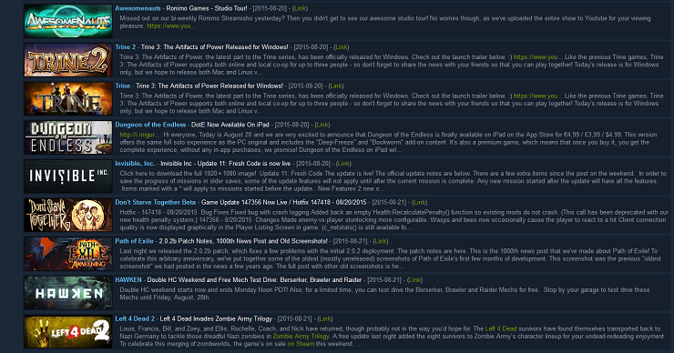

# Steamnews
Steamnews provides a quick overview of the last steam news for each game in your library for the past 4 weeks.
Pretty usefull to easily spot which game has been or will be updated if you dont have auto-update enabled.
Quick and dirty replacement for the clunky steam news interface.

How to ?
---
Flask and Requests need to be installed using the requirements.txt file.

```
pip install -r requirements.txt
```

You need to modify steamnews.py to specify your Steam API key and your Steam ID in order to query your owned game list.
Look for 'API_KEY' and 'STEAM_ID' variables in the script.

You can get your Steam ID from any website offering this service (must feed your steam profile URL) and your Steam API key at this URL:
https://steamcommunity.com/dev/apikey

Run it once manually to generate the JSON file (data.json):

```
python steamnews.py
```

You can now run the webapp.py (Flask app) to enjoy your dirty steam news dashboard.
Run it in background or use gunicorn coupled with any webserver.

```
python webapp.py
```

It is suggested to create a cronjob for the steamnews.py script.
Running it twice a day is clearly enough to get an overview of what's new amongst your games.

Preview:


